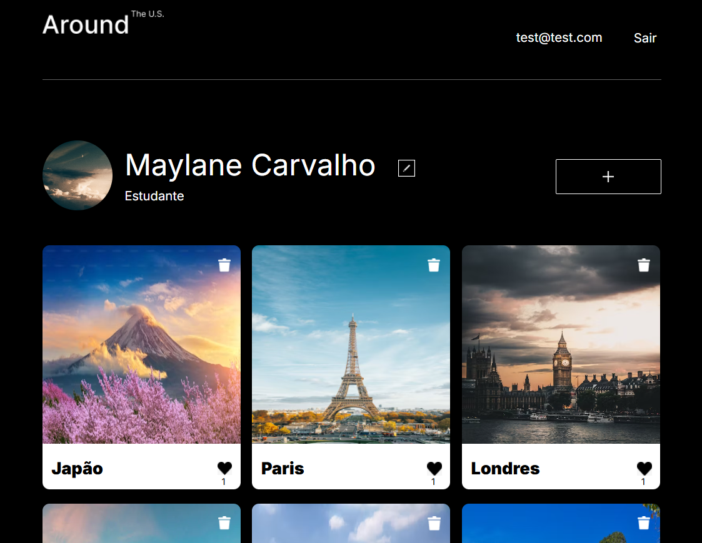

# Tripleten web_project_api_full




A **Photo Card App** é uma aplicação full-stack que permite aos usuários criar, visualizar e interagir com cards de fotos. Cada card pode conter uma imagem, título e curtidas oferecendo uma maneira intuitiva e dinâmica de descobrir fotos. A aplicação conta com um sistema de autenticação, permitindo que os usuários se registrem, façam login e interajam com os cards criados por outros usuários.

## **Tecnologias Utilizadas**

- **Frontend:**
  - **React:** Biblioteca JavaScript para construir interfaces de usuário dinâmicas e responsivas.
  - **Fetch:** Cliente HTTP para realizar requisições ao backend.
  
- **Backend:**
  - **Node.js & Express:** Plataforma e framework para o desenvolvimento do servidor.
  - **MongoDB:** Banco de dados NoSQL para armazenar informações sobre os cards, usuários e interações.
  - **Mongoose:** Biblioteca para modelar e interagir com dados do MongoDB de forma simples e eficaz.

- **Autenticação:**
  - **JWT (JSON Web Tokens):** Para autenticação de usuários e manutenção de sessões.

## **Recursos Principais**

- **Autenticação de Usuários:**
  - Cadastro de novos usuários com validação de dados.
  - Login seguro com token JWT.

- **Criação e Gerenciamento de Cards e usuário:**
  - Upload de imagens para criar cards personalizados.
  - Edição de perfil e exclusão de cards.
  - Visualização de cards criados por outros usuários.

- **Interação com Cards:**
  - Curtir e descurtir seus cards e de outros usuários.

- **Responsividade:**
  - Design responsivo, adaptável a diferentes dispositivos (desktop, tablet e celular).

## **Instalação**

Para rodar a aplicação localmente, siga as etapas abaixo:

1. Clone este repositório:

   ```bash
   git clone https://github.com/malhanecarvalho/web_project_api_full.git
   ```

2. Instale as dependências do servidor (backend):

   ```bash
   cd backend
   npm install
   ```

3. Instale as dependências do frontend:

   ```bash
   cd frontend
   npm install
   ```

4. Configure as variáveis de ambiente. Crie um arquivo `.env` na pasta `backend` e adicione as seguintes variáveis:

   ```bash
   MONGO_URI=your_mongo_database_uri
   JWT_SECRET=your_jwt_secret_key
   ```

5. Inicie o servidor e o frontend:

   - No backend:

     ```bash
     cd backend
     npm start
     ```

   - No frontend:

     ```bash
     cd frontend
     npm start
     ```

6. Abra seu navegador e acesse [http://localhost:3000](http://localhost:3000) para ver a aplicação em execução.

## **Como Contribuir**

Se você deseja contribuir com melhorias ou corrigir problemas, siga os passos abaixo:

1. Faça um fork deste repositório.
2. Crie uma branch para sua feature ou correção: `git checkout -b nome-da-feature`.
3. Realize suas modificações e commit: `git commit -am 'Adiciona nova feature'`.
4. Envie sua branch para o repositório remoto: `git push origin nome-da-feature`.
5. Abra um pull request.

## **Contato**

Se você tiver dúvidas ou sugestões, sinta-se à vontade para abrir uma *issue* ou enviar um e-mail para:[malhanestudent@gmail.com](malhanestudent@gmail.com).

---

